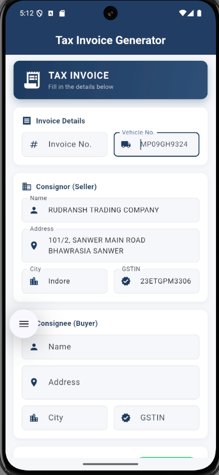
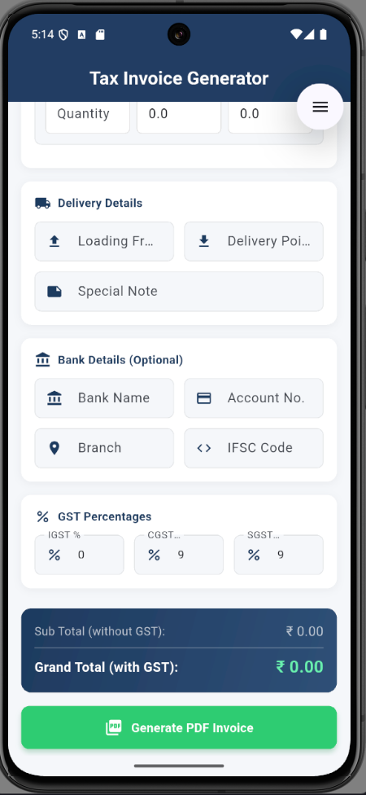

# 📄 PDF Invoice Generator

A Flutter application that generates professional **GST Tax Invoices** in PDF format. Perfect for businesses that need to create and share invoices quickly on mobile devices.


## ✨ Features

- 📝 **Comprehensive Invoice Form** - Enter all invoice details with organized sections
- 🏢 **Seller & Buyer Details** - Manage consignor and consignee information with GSTIN
- 📦 **Multiple Products** - Add unlimited products with description, HSN code, quantity, rate, and amount
- 💰 **GST Calculation** - Automatic IGST, CGST, SGST calculation with customizable percentages
- 📊 **Real-time Totals** - View sub-total and grand total (with GST) as you enter data
- 📄 **Professional PDF Output** - Generate tax invoices matching standard GST invoice format
- ✅ **Form Validation** - Required field validation to ensure complete invoices
- 🎨 **Modern UI** - Clean, intuitive interface with Material Design

## 📱 Screenshots

<p align="center">
  
  
  
  
</p>

## 🚀 Getting Started

### Prerequisites

- Flutter SDK 3.0 or higher
- Dart SDK 3.0 or higher
- Android Studio / VS Code with Flutter extensions

### Installation

1. **Clone the repository**

   ```bash
   git clone https://github.com/yourusername/pdf_invoice_generator.git
   cd pdf_invoice_generator
   ```

2. **Install dependencies**

   ```bash
   flutter pub get
   ```

3. **Run the app**
   ```bash
   flutter run
   ```

## 📦 Dependencies

| Package              | Purpose                           |
| -------------------- | --------------------------------- |
| `pdf`                | PDF document generation           |
| `path_provider`      | Access to file system directories |
| `permission_handler` | Storage permission handling       |
| `open_file`          | Open generated PDF files          |
| `intl`               | Date formatting                   |

## 📋 Invoice Sections

### Consignor (Seller)

- Company Name
- Address
- City
- GSTIN

### Consignee (Buyer)

- Buyer Name
- Address
- City
- GSTIN

### Products

- Description
- HSN/SAC Code
- Quantity
- Rate
- Amount

### Delivery Details

- Loading From
- Delivery Point
- Special Note

### Bank Details (Optional)

- Bank Name
- Account Number
- Branch
- IFSC Code

### GST Percentages

- IGST %
- CGST %
- SGST %

## 🏗️ Project Structure

```
lib/
├── main.dart                 # App entry point
├── models/
│   └── invoice_data.dart     # Invoice data model with calculations
├── screens/
│   └── invoice_form_screen.dart  # Main form UI
└── services/
    └── pdf_generator.dart    # PDF generation service
```

## 📄 Generated PDF Format

The generated PDF includes:

- **Header**: TAX INVOICE title
- **Consignor Section**: Seller details with GSTIN
- **Invoice Info Grid**: Invoice number, date, vehicle number, loading/delivery points
- **Consignee Section**: Buyer details with special note
- **Buyer Section**: Additional buyer info if different from consignee
- **Items Table**: Products with HSN/SAC, quantity, rate, and amount
- **Amount in Words**: Total amount converted to words (Indian format)
- **Tax Breakdown**: Sub Total, IGST, CGST, SGST, Grand Total
- **Bank Details**: Payment information
- **Declaration**: Standard invoice declaration
- **Authorized Signatory**: Signature section

## 🎨 Customization

### Change Default Seller Details

Edit the default values in `lib/screens/invoice_form_screen.dart`:

```dart
final _consignorNameController = TextEditingController(text: 'YOUR COMPANY NAME');
final _consignorAddressController = TextEditingController(text: 'YOUR ADDRESS');
final _consignorGstinController = TextEditingController(text: 'YOUR GSTIN');
```

### Modify GST Rates

Default rates can be changed in the form or in the model:

```dart
this.igstPercent = 0.0,
this.cgstPercent = 9.0,
this.sgstPercent = 9.0,
```

## 📝 License

This project is licensed under the MIT License - see the [LICENSE](LICENSE) file for details.

## 🤝 Contributing

Contributions are welcome! Please feel free to submit a Pull Request.

1. Fork the project
2. Create your feature branch (`git checkout -b feature/AmazingFeature`)
3. Commit your changes (`git commit -m 'Add some AmazingFeature'`)
4. Push to the branch (`git push origin feature/AmazingFeature`)
5. Open a Pull Request

## 📧 Contact

For any queries or suggestions, please open an issue on GitHub.

---

<p align="center">Made with ❤️ using Flutter</p>
